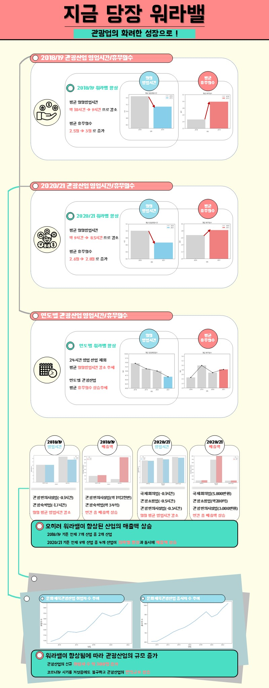

# 🚩 관광통계 인포그래픽 공모전
관광업 워라벨 분석 및 시각화

----------------------------------------------------------
## 🖥️ 프로젝트 소개
코로나 이후 관광업 종사자의 워라벨 변화
 
관광업 변화

----------------------------------------------------------
## 🕰️ 프로젝트 기간
* 2023.09.04 - 2023.10.04

----------------------------------------------------------
## ⚙ 개발환경
- Python (Version 3.8.18 / Window)
- <strong>Framework: </strong> pandas, numpy, matplotlib
- <strong>IDE: </strong> Visual Studio Code, jupyter lab

----------------------------------------------------------
## 📍 프로젝트 구성
뉴스기사 크롤링, 팀 데이터 통합  
워드클라우드, 단어빈도 분석

----------------------------------------------------------
## 📌 프레젠테이션

