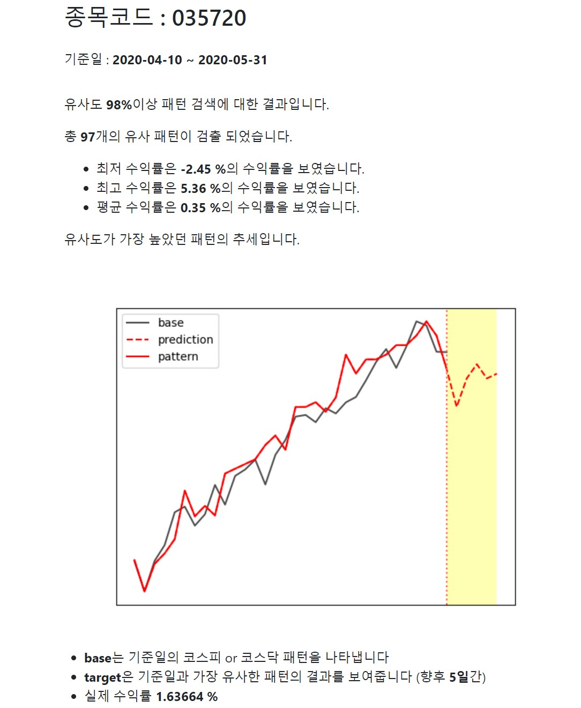

# 🚩 ETRI 오픈 api활용사례 공모전
ETRI 오픈 api활용

----------------------------------------------------------
## 🖥️ 프로젝트 소개
우리나라 코스피, 코스닥 지수 그래프와
 
특정 종목 하나의 그래프의 
 
유사도 분석 및 예측

----------------------------------------------------------
## 🕰️ 프로젝트 기간
* 2023.10.30 - 2023.11.06

----------------------------------------------------------
## ⚙ 개발환경
- Python (Version 3.8.18 / Window)
- <strong>Framework: </strong> pandas, numpy, matplotlib, sqlite3, flask, FinanceDataReader
- <strong>IDE: </strong> Visual Studio Code, jupyter lab

----------------------------------------------------------
## 📍 프로젝트 구성
코스피, 코스닥 DB 데이터 불러오기  
지수별 종목 그래프 함수  
유사도 분석 및 예측

----------------------------------------------------------
## 📌 프레젠테이션

