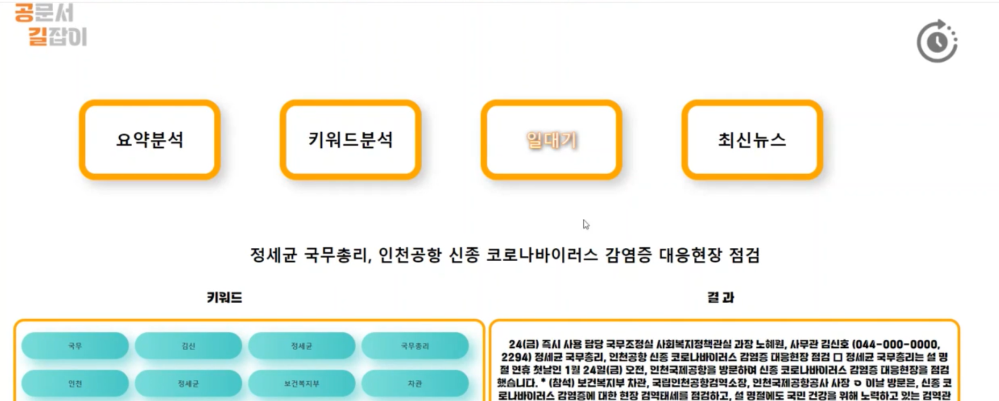

# 🚩 국회 공공데이터 활용 경진대회
AI 공문서 플랫폼

----------------------------------------------------------
## 🖥️ 프로젝트 소개
행정안전부, 국회 데이터 활용
 
공문서 데이터를 활용한 서비스 구현 

----------------------------------------------------------
## 🕰️ 프로젝트 기간
* 2024.01.24 - 2024.02.07

----------------------------------------------------------
## ⚙ 개발환경
- Python (Version 3.8.18 / Window)
- <strong>Framework: </strong> pandas, flask, konlpy, beautifulsoup4, sumy,  transformers[torch], scikit-learn
- <strong>IDE: </strong> Visual Studio Code, jupyter lab

----------------------------------------------------------
## 📍 프로젝트 구성
AI 공문서 플랫폼 구축 
공공데이터 포털 api 활용 
요약문 생성, 키워드 제시, 관련 정보 추출, 관련 최신 뉴스 제공 

----------------------------------------------------------
## 📌 프레젠테이션

